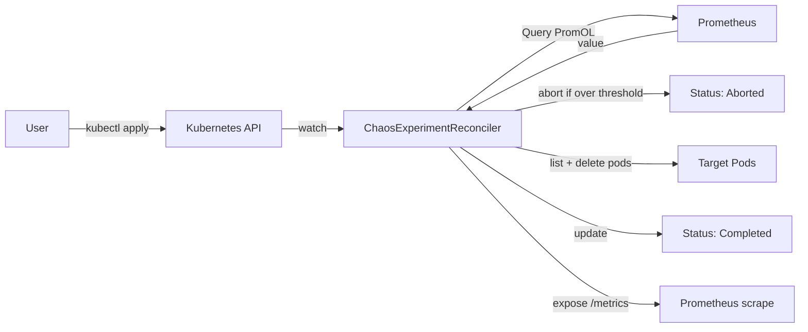

# chaos-scheduler-operator

A Kubernetes operator that runs scheduled fault injection experiments with a Prometheus-based SLO burn-rate guardrail. If your reliability signals are already burning, the operator refuses to make things worse.

## Why this exists

I run a homelab k3s cluster whose observability stack I also use as a portfolio artifact. For about eight months a plain `CronJob` chaos-monkey killed one random pod every two hours across a couple of namespaces. Fine for demonstrating that pods survive restarts, useless as a real reliability tool.

In mid-September 2026 I spent three days investigating recurring one-hour gaps in the 7-day SLO series on my homelab Grafana dashboards. Every day, in a predictable window overlapping a systemd-timer-driven Prometheus restart, samples for the SLO recording rules would disappear retroactively. I churned through six wrong hypotheses (rolling-window off-by-one, `avg_over_time` semantics on incomplete ranges, WAL corruption at rest, cadvisor churn, kubelet GC, rule evaluation latency) before landing on the real cause: an unresolved upstream bug ([prometheus#16074](https://github.com/prometheus/prometheus/issues/16074)) corrupts WAL segments periodically, my nightly restart timer was working around it, and the restart's WAL replay was silently deleting every segment newer than the corruption. The workaround was destroying an hour of head-window data every night.

The whole time, the chaos-monkey `CronJob` was firing on schedule regardless of the fact that Prometheus was actively eating its own data. It had no way to know the SLO error budget was already smoking; it was just a `spec.schedule` and a shell script. That's the gap this operator closes.

## What it does

- **Declarative**: chaos experiments are Kubernetes CRs (`ChaosExperiment`), reconciled by a controller-runtime manager. `kubectl get chaos -A` shows schedule, last run, last result, run count, and next fire time as printer columns.
- **Guardrailed**: an optional `spec.guardrail` runs an arbitrary PromQL query before the action. If the value exceeds the configured threshold, the reconciler aborts the run and records a reason in status. A burning SLO stops chaos automatically.
- **Scoped**: the pod selector requires an explicit `namespace` and a non-empty `labelSelector`. There is no "match everything" mode. A validating webhook will reject reserved namespaces (`kube-system`, `kube-public`) in v1alpha2.
- **Observable**: the operator exposes its own metrics on the controller-runtime metrics registry:
  - `chaos_experiment_runs_total{namespace,name,result}` where result is `Completed`, `Aborted`, or `Failed`
  - `chaos_experiment_guardrail_check_duration_seconds{namespace,name,outcome}` for guardrail latency
  - `chaos_experiment_last_run_timestamp{namespace,name}` for staleness alerts

## Example

```yaml
apiVersion: chaos.dstepanov.dev/v1alpha1
kind: ChaosExperiment
metadata:
  name: kill-random-app-pod
  namespace: apps
spec:
  schedule: "0 */2 * * *"
  selector:
    namespace: apps
    labelSelector:
      matchLabels:
        chaos.dstepanov.dev/eligible: "true"
  action:
    type: PodKill
    podKill:
      count: 1
  guardrail:
    prometheusUrl: http://prometheus.monitoring.svc:9090
    query: 'max(slo:service:burn_rate_1h)'
    abortIfGreaterThan: "6"
  ttl: 5m
```

Pods opt in with the `chaos.dstepanov.dev/eligible=true` label. Every two hours the reconciler queries the max 1-hour burn rate across services. If it's over 6x, the run is aborted with a status reason naming the exact value that tripped the guardrail. Otherwise one eligible Running pod is picked at random and deleted.

## Architecture



## Design notes

- The reconciler is stateless. Scheduling state lives in `status.lastRun` and `status.nextRun` on the CR; requeueing is driven by `RequeueAfter: sched.Next(lastRun) - now`. No in-memory cron table.
- Cron parsing is anchored to UTC so schedule semantics don't shift between developer machines (`time.Local`) and containers (UTC by default). CR authors can reason about `0 */2 * * *` as "every even hour UTC" regardless of where the operator runs.
- `PodKill` filters to `Phase=Running` pods with no active `DeletionTimestamp` before shuffling, so the requested count reflects actual kills, not attempts against already-terminating pods.
- The guardrail query has its own timeout independent of the reconciler context. A slow Prometheus becomes a `Failed` result with a clear reason, not a hung reconcile.
- Prometheus client is injected via a factory (`promAPIFactory`) so the envtest suite drives the guardrail path with a `fakePromAPI` returning canned values.

## Getting started

Prerequisites: Go 1.22+, `kubectl`, a cluster (k3s, kind, or anything with cluster-admin).

```bash
# Run tests (envtest downloads its own apiserver + etcd)
make test

# Build the manager binary
make build

# Deploy CRDs and manager into the current-context cluster
make install
make deploy IMG=ghcr.io/bibigon14/chaos-scheduler-operator:latest

# Apply the sample experiment
kubectl apply -f config/samples/chaos_v1alpha1_chaosexperiment.yaml

# Watch it
kubectl get chaos -A -w
```

Uninstall:

```bash
make undeploy
make uninstall
```

## Status

**v1alpha1**: `PodKill` action, `Prometheus` guardrail, cron scheduling, status subresource. Deployed to a single-node k3s homelab and running against real SLO burn-rate rules.

## Roadmap (v1alpha2)

- Additional actions: `NetworkChaos` (partition, latency injection via tc), `StressChaos` (cpu/memory pressure), `ContainerKill` (target one container in a multi-container pod).
- Validating admission webhook: reject `kube-system` and other reserved namespaces, reject empty selectors defensively (already required by the CRD schema, but the webhook message is friendlier than a JSON schema error).
- Multiple guardrails per experiment with `all-of` / `any-of` semantics.
- Slack / Telegram notifier as an optional side output on `Aborted` results.

## License

Apache-2.0. See [LICENSE](LICENSE).